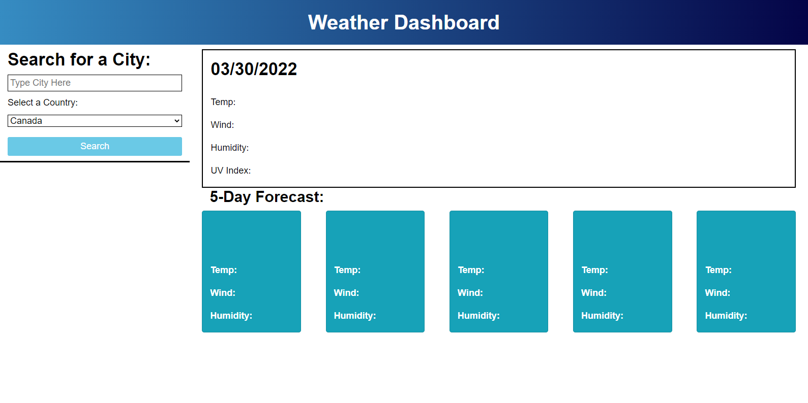
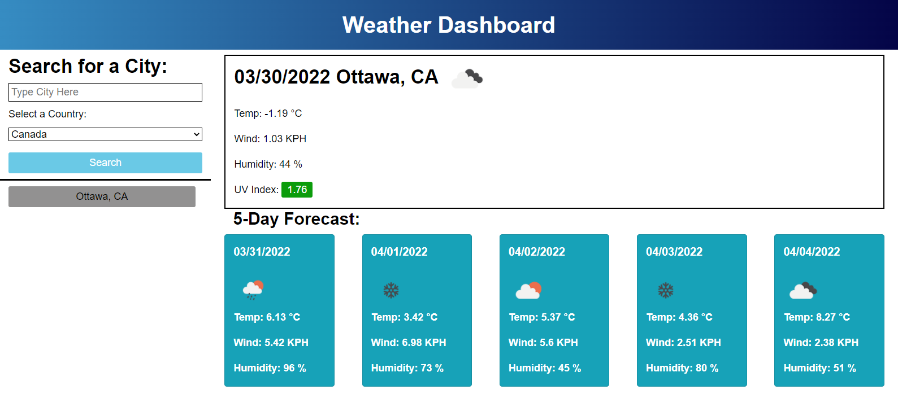
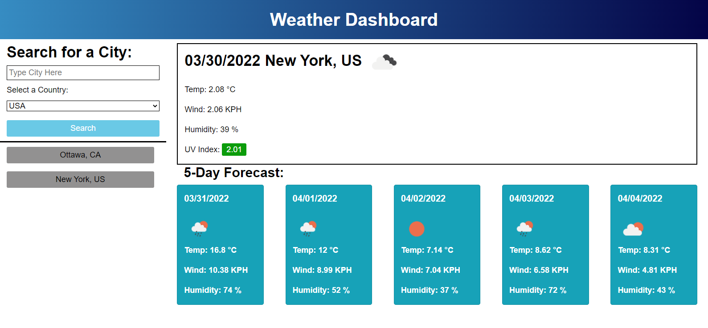

# Weather Dashboard
Week 6 Challenge - Weather Dashboard

## About This Project

This project is a weather dashboard that allows the user to search for a city, and the site will display the current weather conditions, and the conditions for the next 5 days.

When the user performs a search, the search parameters will be saved to local storage, and a button will be generated in the left column to allow the user to perform the same search again without having to type the city. If the user performs the exact same search twice, then the input data will not be saved a second time.

Features:
* Drop down box to select country from either Canada, USA or UK - allows the user to search for cities with the same name - e.g. can specify whether London UK, or London Canada, etc
* Search will not perform if city input box left empty
* UV Index is colour coded according to the results to indicate low, medium, high risk (0-3 green, 4-6 amber, 7+ red)
* Previous search results button generated - will not create a duplicate
* Weather icon displayed to indicate conditions
* Temperature, wind speed, humidity also display for current day and next 5 days

---
## Screenshots

The site upon loading for the first time, where no search data is present

Showing the results when searching for "Ottawa, CA". The search button has been added in the left column

Showing the results when searching for "New York, USA". The search button has been added in the left column

---
## Links
[Project Code on Github](https://github.com/philmcgarty/weather "Github")

[Deployed Site](https://philmcgarty.github.io/weather)